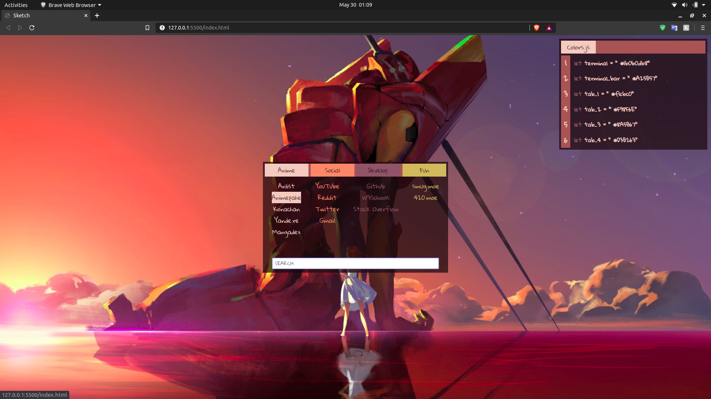

# Asuka-Start (V.1)
A minimal startpage created with Pywal in mind.
<br>
<a href='https://imvampi.github.io/Asuka-Start/'>Demo.</a>

Customization:
---
- **Links**
Open index.html and configure them manually 
```html
<div class="terminal-bar"> 
                    <div class="tab">Anime</div>
                    <div class="tab">Social</div>
                    <div class="tab">Develop.</div>
                    <div class="tab">Fun</div>
                </div>
                <div class="categories">
                    <div id="category-1" class="category">
                        <a href="https://anilist.co/" class="link">Anlist</a>
                        <a href="https://animepahe.com/" class="link">Animepahe</a>
                        <a href="http://konachan.net/" class="link">Konachan</a>
                        <a href="https://yande.re/post" class="link">Yande.re</a>
                        <a href="https://mangadex.org/" class="link">Mangadex</a>
                    </div>
```
- **Color Schemes**
If you want to edit the color scheme manually you can do so by changing these variables in style.css
```css
:root {
    --terminal-color: #1b0b0db8;
    --terminal-bar: #A25B57;
    --tab-1: #f1cbc0;
    --tab-2: #F98F6E;
    --tab-3: #8A5B67;
    --tab-4: #D3B263;
}
```

- **Pywal customization**
In order to use pywal with Asuka you must cd to the cloned or downloaded repo and create a symlink to the ~/.config/wal/colors.css by typing this command into your terminal
```bash
     ln -s /home/YOURUSERNAME/.cache/wal/colors.css colors.css
```    
this creates a real time link to your constantly changing color schemes.
once you do this you need to enable pywal by editing the background.js file like so
```javascript
let pywal = true;
```
Next we will grab the relative path of the image (in this case we will use a directory) we can do this weal realpath which takes two absolute paths as arguments.
```bash
realpath --relative-to="$file1" "$file2"
```
file1 in this case is the absolute path of the asuka directory. You can get this by typing 
```bash
pwd
```
and you can get file2's absolute path the same way. <br>
Once you have the relative path, head over to background.js and change 2 things.
```js
let relative_path = "../../../../Pictures/anime/wallpaper/"

wallpaper = wallpaper.split('url("/home/anthony/Pictures/anime/wallpaper/').pop(); //Remember to change this to what fits your path in your colors.css
```
You're done!! Now your startpage will change in realtime when you make changes to your desktop enviornment using pywal.

